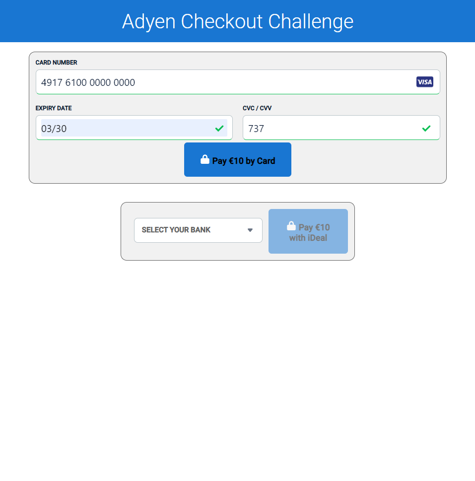
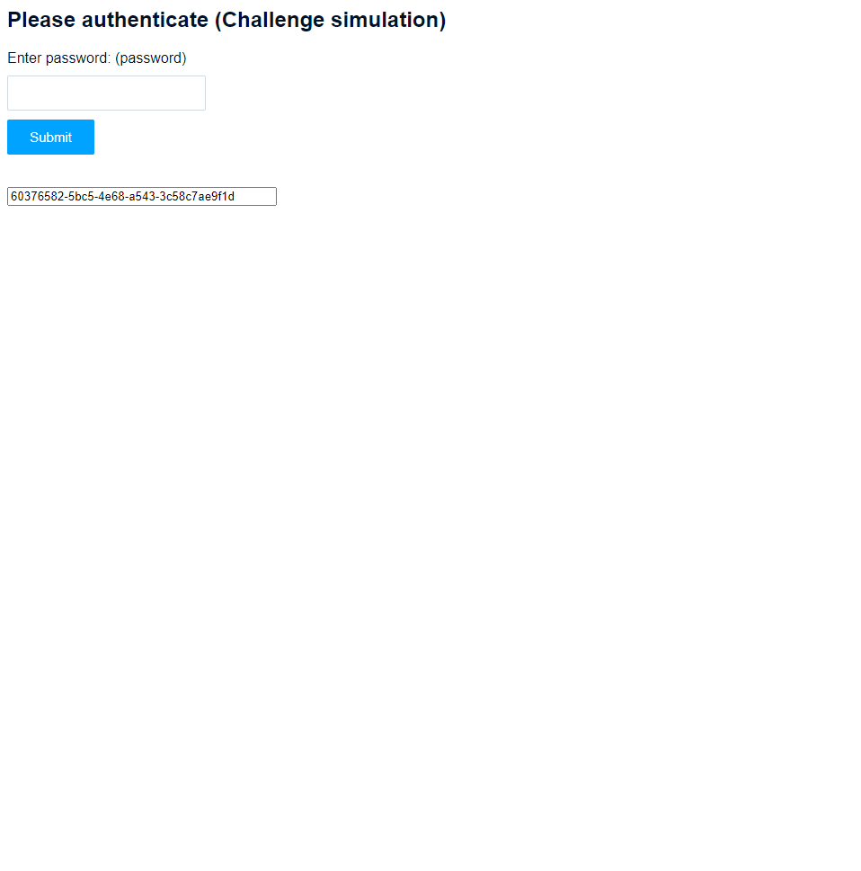
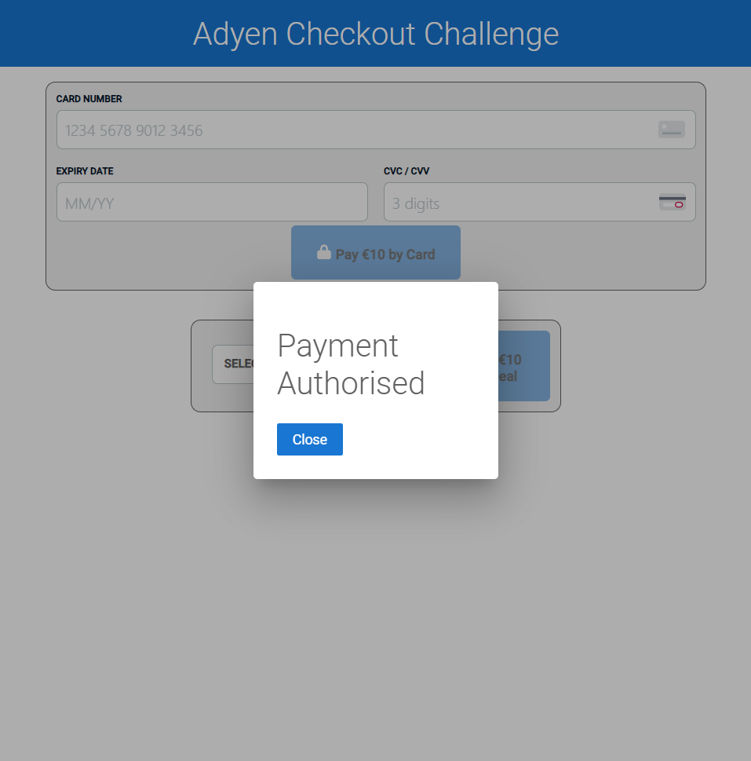
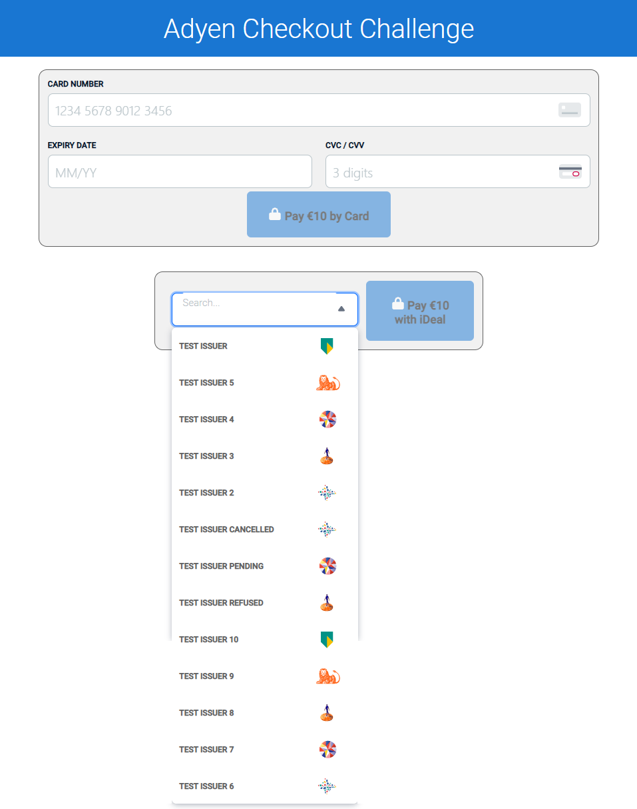
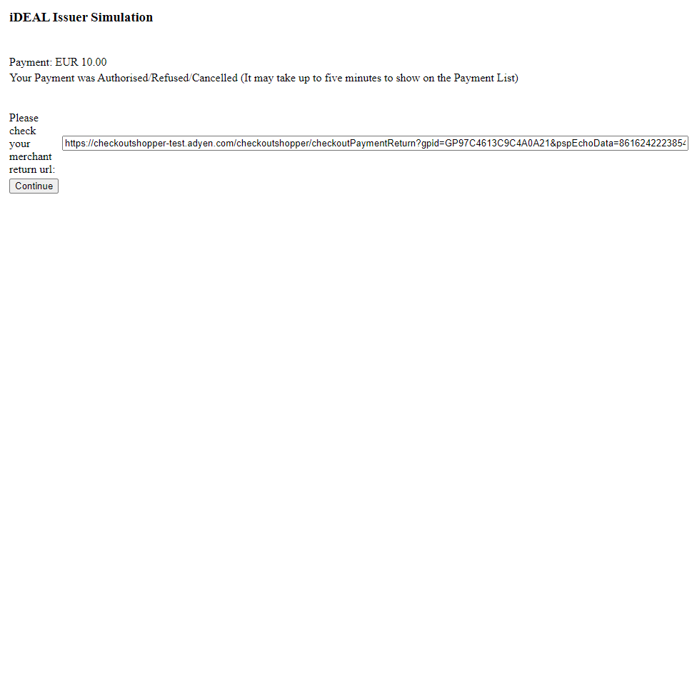
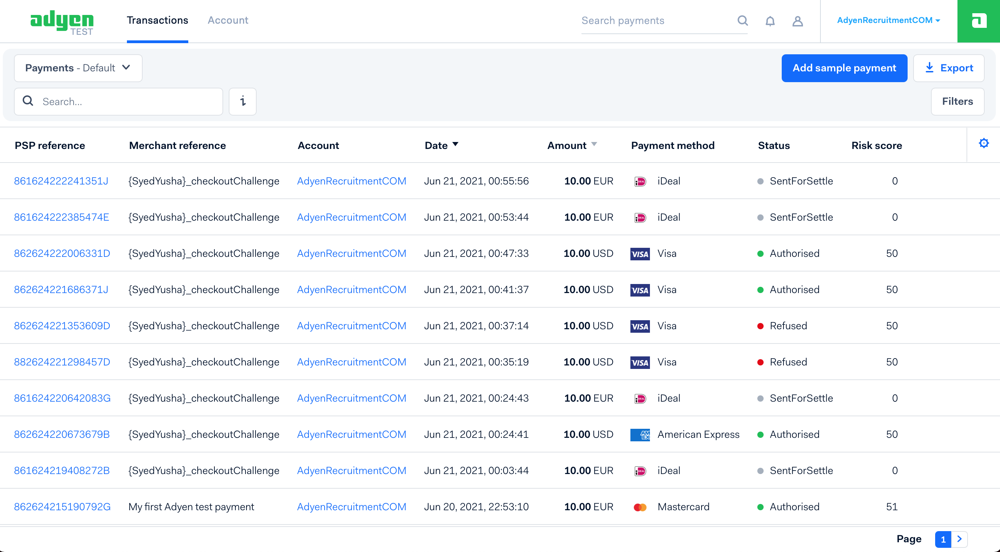

# CheckoutChallenge

This project was generated with [Angular CLI](https://github.com/angular/angular-cli) version 11.2.4.

## Prerequisites
- Install Node.js
- Install Angular CLI

## To run this project
1. Install dependencies

Run `npm i` to install all dependencies required to run the dev server.

2. Development server

Run `npm start` to start the dev server. Then navigate to `http://localhost:8080/` in your browser.

## Example Card Payment

* Enter card details

  

* Redirect to Perform Challenge if requested

  

* Return to confirm payment status

  

## Example iDeal Payment

* Select issuer

  

* Redirect to confirm payment

  

* Return to confirm payment status

  

## Transactions visible on Adyen customer area

  

